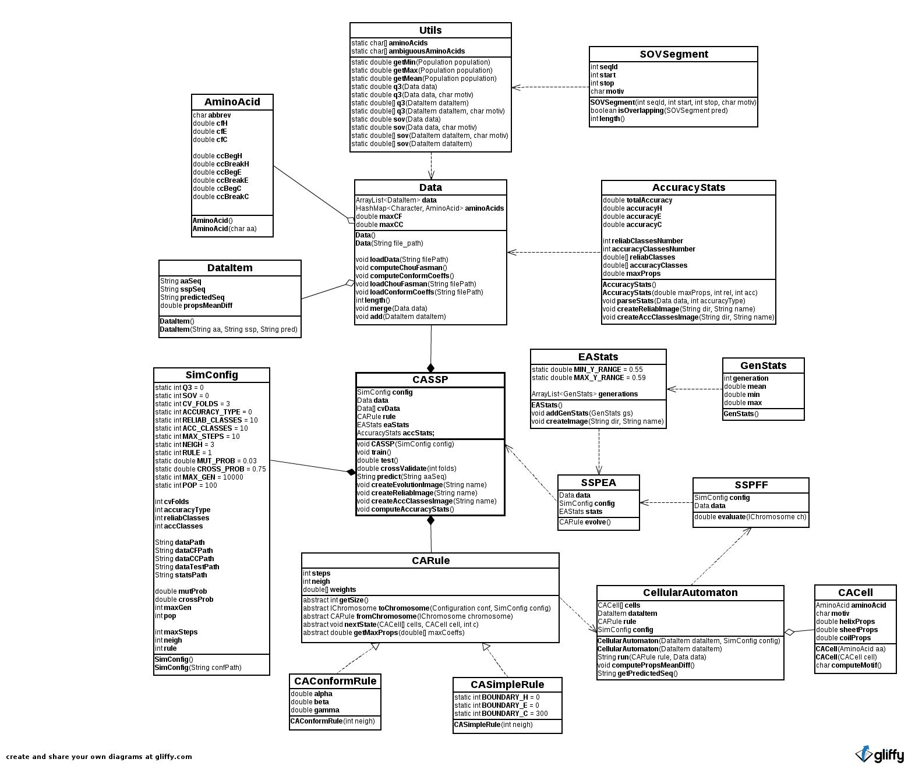
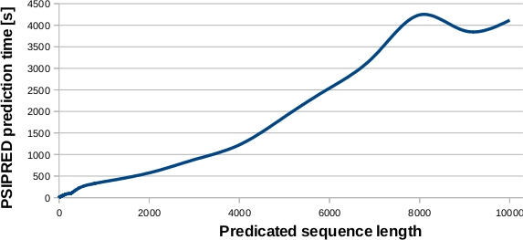

======================================================
CASSP (Cellular Automata Secondary Strucure Predictor)
======================================================

Requirements
============

* `JGAP <http://jgap.sourceforge.net/>`_

* `jgnuplot <http://jgnuplot.sourceforge.net/>`_

* `JUnit <http://junit.org/>`_

* `Log4j <http://logging.apache.org/log4j/2.x/>`_

* `Cobertura <http://sourceforge.net/projects/cobertura/>`_

Compiling & Execution
=====================

 |    ``$ cd CASSP``
 |    ``$ ant clean``
 |    ``$ ant init``
 |    ``$ ant compile``
 |    ``$ ant test``
 |    ``$ ant run``
 |    ``$ ant cobertura # tests code covering``
 |    ``$ ant # clean, init, compile, test and cobertura``

Tests
=====

* `JUnit tests report <http://www.stud.fit.vutbr.cz/~xbriga00/dp/reports/junit/>`_
* `Cobertura coverage report <http://www.stud.fit.vutbr.cz/~xbriga00/dp/reports/cobertura/>`_

`Experiments <http://www.stud.fit.vutbr.cz/~xbriga00/dp/exps/>`_
================================================================

* PSIPRED results

 ========== ======  ======
 Dataset     Q3     SOV
 ========== ======  ======
 rs_126     81.857  70.220
 cb_513     81.101  69.291
 pdb_vyber  79.905  69.165
 ========== ======  ======
